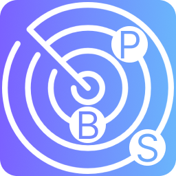
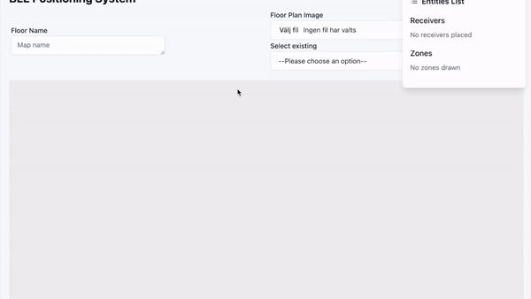
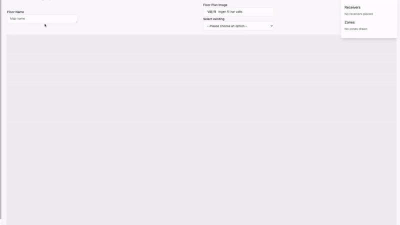
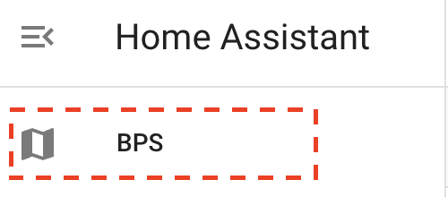
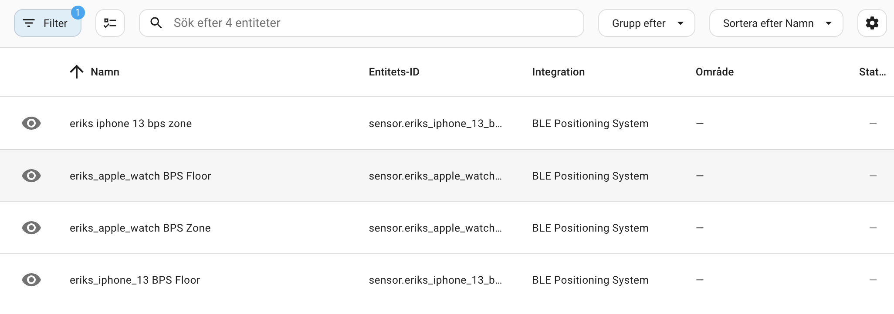

<div align="center">
  
  <h1>BPS+ for Home Assistant</h1>
  <p><strong>Indoor BLE positioning with floors, zones and a visual calibration workspace.</strong></p>

  <p>
    <a href="https://github.com/danielmigueltejedor/BPS-plus/releases"></a>
    
    
    
    <a href="./LICENSE"></a>
  </p>

  <p>
    <a href="#installation">Installation</a> ·
    <a href="#configuration">Configuration</a> ·
    <a href="#entities">Entities</a> ·
    <a href="https://github.com/danielmigueltejedor/BPS-plus/issues">Support</a>
  </p>
</div>

---

BPS+ is an unofficial Home Assistant integration for locating Bluetooth devices inside a building. It combines distance data from [Bermuda](https://github.com/agittins/bermuda), receiver placement and floor-plan geometry to expose useful floor and room information for dashboards and automations.

> [!IMPORTANT]
> BPS+ is experimental. Positioning accuracy depends on receiver placement, radio interference, building materials and calibration. It should not be used for safety-critical presence detection.

## Highlights

| Capability | What it provides |
|---|---|
| Indoor positioning | BLE trilateration from multiple Home Assistant Bluetooth proxies |
| Floors and zones | Floor and room-level states that can be used in automations |
| Visual workspace | Place receivers, draw zones and walls, and inspect movement in real time |
| Guided calibration | Manual calibration plus a multi-receiver Pro calibration workflow |
| Wall compensation | Configurable signal penalties for different wall materials |
| Home Assistant-native setup | Config flow, stable unique IDs and coordinator-based updates |

## Preview

<p align="center">
  
  
</p>

<details>
<summary><strong>More screenshots</strong></summary>
<br>
<p align="center">
  
  
</p>
</details>

## Requirements

- Home Assistant 2025.1 or newer
- [Bermuda](https://github.com/agittins/bermuda) configured with usable distance entities
- At least three well-positioned Bluetooth proxies for meaningful 2D positioning
- A 64-bit installation is strongly recommended

> [!WARNING]
> BPS+ depends on NumPy, SciPy and Shapely. These packages may fail to install on 32-bit ARM systems or older hardware. Raspberry Pi 5 with 64-bit Home Assistant OS is known to work.

## Installation

### HACS custom repository

BPS+ is not currently listed in the default HACS catalogue. Add it once as a custom integration:

1. Open **HACS → Integrations**.
2. Open the three-dot menu and choose **Custom repositories**.
3. Add `https://github.com/danielmigueltejedor/BPS-plus` with category **Integration**.
4. Search for **BPS+**, select **Download**, and restart Home Assistant.

[](https://my.home-assistant.io/redirect/hacs_repository/?owner=danielmigueltejedor&repository=BPS-plus&category=Integration)

### Manual installation

1. Download the [latest release](https://github.com/danielmigueltejedor/BPS-plus/releases/latest).
2. Copy `custom_components/bps_plus` to `/config/custom_components/bps_plus`.
3. Restart Home Assistant.

## Configuration

1. Go to **Settings → Devices & services → Add integration**.
2. Search for **BPS+**.
3. Select the BLE devices discovered through Bermuda.
4. Complete the setup and open the new BPS+ sidebar panel.
5. Add your floor plan, place each receiver and define the relevant zones.

### Calibration

The sidebar workspace supports two calibration approaches:

- **Manual:** choose a receiver and tune its factor and offset.
- **Pro mode:** mark your real position on the plan and run a 15-second calibration against all visible proxies. Repeat from additional positions when requested.

Save the floor plan after calibration so the updated values persist.

### Wall compensation

Draw each wall with two points, then choose a per-floor signal penalty. The positioning engine applies that penalty whenever the estimated path to a receiver crosses a wall.

| Environment | Suggested starting value |
|---|---:|
| Open space | `0.8` |
| Lightweight partition | `1.6` |
| Standard interior wall | `2.5` |
| Brick wall | `3.4` |
| Concrete wall | `4.5` |
| Wall with metal enclosure | `6.0` |

These are starting points, not universal measurements. Tune them against observations from your own installation.

## Entities

Entity IDs vary with the configured device name.

| Entity pattern | Description |
|---|---|
| `sensor.bps_<device>_floor` | Detected floor |
| `sensor.bps_<device>_zone` | Detected room or zone |
| `sensor.bps_<device>_distance_error` | Positioning error estimate |
| `sensor.bps_<device>_last_update` | Last successful update |
| `sensor.bps_<device>_x` | X coordinate — planned |
| `sensor.bps_<device>_y` | Y coordinate — planned |

### Automation example

```yaml
automation:
  - alias: Turn on the kitchen light when the tracked device enters
    triggers:
      - trigger: state
        entity_id: sensor.bps_phone_zone
        to: Kitchen
    actions:
      - action: light.turn_on
        target:
          entity_id: light.kitchen
```

## How it works

1. Bermuda supplies distance estimates for tracked BLE devices.
2. BPS+ matches those measurements with the receiver positions on the floor plan.
3. SciPy minimizes the positioning error; Shapely resolves the resulting point against the configured geometry.
4. Home Assistant receives the calculated floor, zone and diagnostic states.

BPS+ also uses Home Assistant Bluetooth metadata to keep a stable identity where devices rotate private MAC addresses.

## Support and development

- Read the [changelog](./CHANGELOG.md) before updating.
- Search [existing issues](https://github.com/danielmigueltejedor/BPS-plus/issues) before opening a new one.
- Include the Home Assistant version, BPS+ version, hardware architecture and sanitized diagnostics with bug reports.
- Never publish Bluetooth addresses or other sensitive household data without redacting them.

## Credits and license

BPS+ is based on [Hogster/BPS](https://github.com/Hogster/BPS) and uses distance data from [Bermuda](https://github.com/agittins/bermuda). It is released under the [MIT License](./LICENSE).

This project is not affiliated with or endorsed by Home Assistant, BPS or Bermuda.

<div align="center">
  <sub>Created and maintained by <a href="https://github.com/danielmigueltejedor">Daniel Miguel Tejedor</a>.</sub>
  <br><br>
  <a href="https://paypal.me/DanielMiguelTejedor"></a>
</div>
